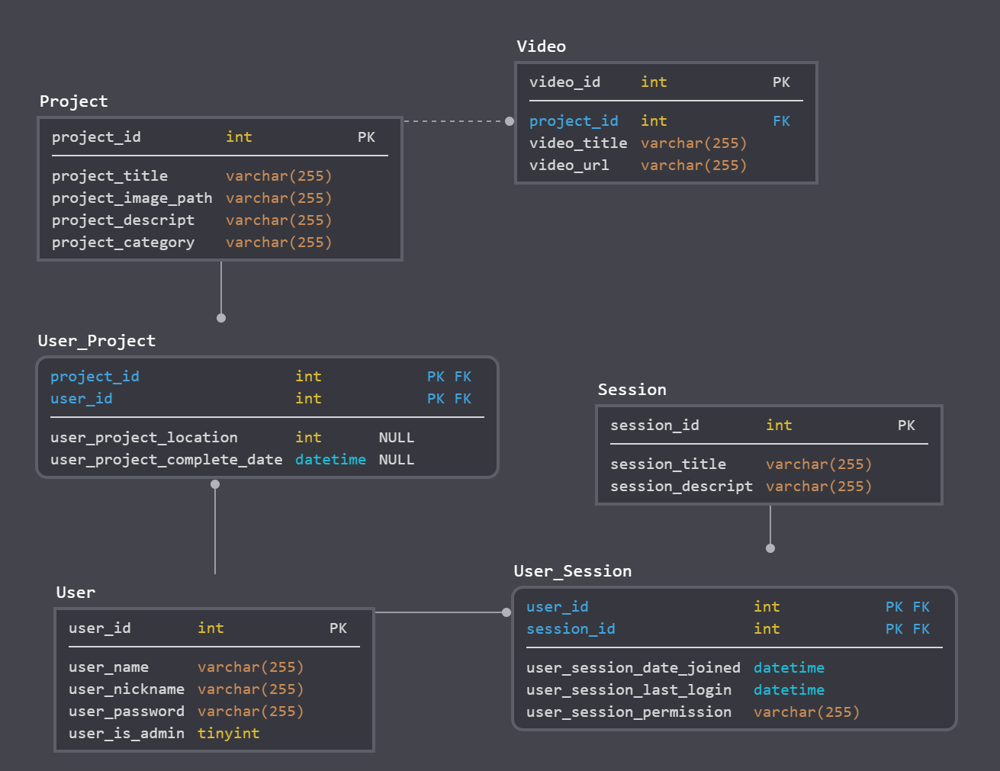
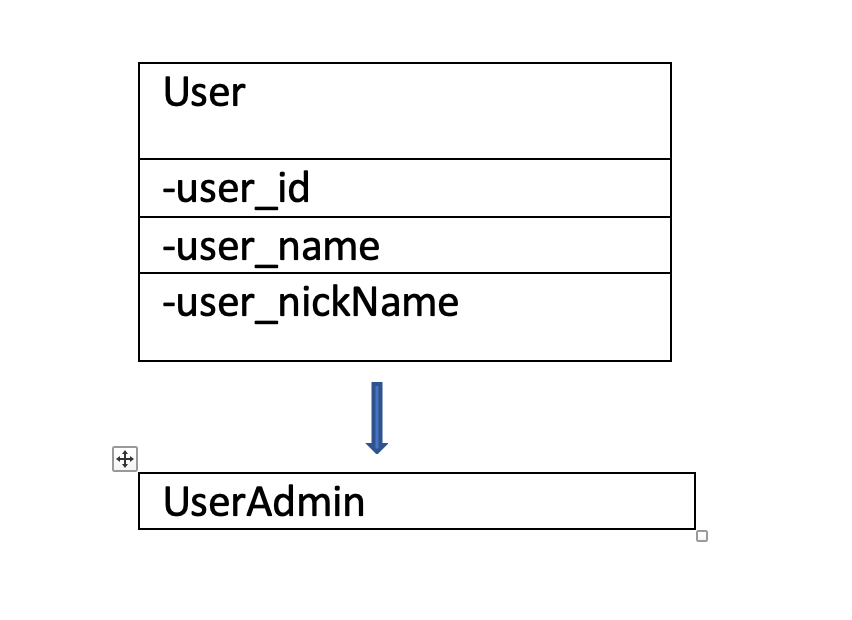

# coding-projects

Running development environment on local with Docker
* Install docker desktop and make sure it is running on your computer
* From the project root, run docker-compose up
* The default url is localhost:5001/
* To run composer for the first time on your docker server, use ```docker exec -it app_name bash``` and run ```composer install```

To update composer
* ```docker exec -it codingprojectscom_app_1 bash``` or ```coding-projects_app_1``` and then run ```composer update```

To enable routing for the docker container
* Make sure the .htaccess file is in the project root
* Run the command ```docker exec -it app_name bash``` to open a terminal inside the running docker app container
* Run the command ```a2enmod rewrite``` and then ```service apache2 restart```. This will terminate the web_app container so you'll need to restart it with ```docker-compose up```

Coding Projects
--------------------------------------
Coding projects is a web app designed for students to introduce 
them to today’s world changing weapon programming. 
By Keller Flint and Laxmi Kandel

Getting Started
--------------------------------------
We have Users (student and teacher) and Admin.
Login Credentials:
-> Student: testuser
-> Teacher: laxmi
-> Admin: keller
Password (for all users): 1234

Built With
---------------------------------------
•	Fat free php framework: Routes all URLs and leverages a templating language 
    using the Fat-Free framework.
    
•	Model View Control: All the database/ business logic has been separated with  
    Model View Control pattern. 
    
•	Routes: Each route to a page is defined in the controller class in a function 
    using the fat free object and called form index.php. All the html files are 
    loaded through the Template class.
    
•	PDO: Database class has been created which has functions using prepared 
    statements to delete, update, insert, remove and basically get the required 
    data from the database.
    
•	OOP has been used to defines multiple classes, including inheritance relationship.
    Coding projects has total five classes to manage all project using MVC. 
    In this project we have UserAdmin class with extends the User class.

Validation
-----------------------------------------

•	Java script and jQuery: There is client-side, server-side and real 
    time validation in this project.
    
Comments
------------------------------------------

•	Project has class-level DocBlock and function docBlock.
•   Follows PEAR standards.

JSON and ajax
--------------------------------------------
•   We have used JSON and Ajax to make our pages dynamic.
•   Refresh data in our web pages without refreshing the actual page. 
•   List of session users, projects and users is done by using ajax.


ER-DIAGRAM


UML DIAGRAM



